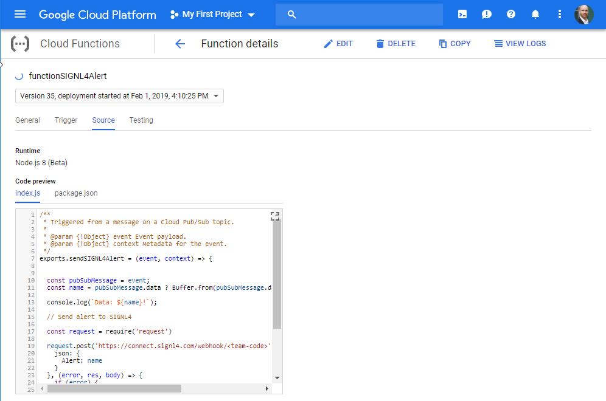

# Mobile alerting with tracking & escalation for Google IoT Core using MQTT
 
## Why SIGNL4
 
Google IoT Core provides a scalable, rapid solution development platform, made up of tightly integrated components that can be customized to help you solve your business challenges. Whether you are collecting data from a Raspberry Pi or industrial machines, the platformcan help you manage your IoT devices in real time. Pairing this powerful IoT platform with SIGNL4 can enhance your daily operations with an extension to your mobile team in the field or on the shop floor.
 


## How it Works
 
All it takes to pair Google IoT Core and SIGNL4 is the following flow:


Good news is that the integration with SIGNL4 is the easiest part of the whole flow and it is done by a Cloud Function that calls the SIGNL4 webhook.

Integration Capabilities
- Service engineers alerted via mobile push, text and voice
- Staff can acknowledge and take ownership for critical events that occur
- Alerts are escalated in case of no response
- Communicate within an alert to address a particular problem
- Alert on critical device states
- Two-way integration to interact or set the device state
 
Scenarios
- Industrial IoT
- Industry 4.0
- IoT Service Alerting
- IoT Device Management
- Manufacturing, Utility, Oil and Gas, Agriculture, etc.
 
## Hot to integrate
 
### Integrating SIGNL4 with Google IoT Core
 
Gathering events from IoT devices and sending team alerts in case of critical incidents is a broad field. It starts with simple prototypes using a Raspberry Pi and goes up to industrial IoT scenarios, machine data or distributed systems in the field.
 
The following example demonstrates the whole flow from an event on a device, through Google IoT Core and then notifying an engineer using SIGNL4.

SIGNL4 is a mobile alert notification app for powerful alerting, alert management and mobile assignment of work items. Get the app at https://www.signl4.com.

Cloud IoT Core is a fully managed service that allows you to easily and securely manage and connect your IoT devices. The integration with SIGNL4 is straightforward. In the following we will show an example on how to send alert notifications using SIGNL4 in case of MQTT events coming from devices in the field.

Prerequisites
A SIGNL4 (https://www.signl4.com) account
Access to the Google Cloud Platform (https://console.cloud.google.com)
A Raspberry Pi device (optional)
Sample Python code to send MQTT messages (https://github.com/GoogleCloudPlatform/python-docs-samples/tree/master/iot/api-client/mqtt_example, optional)

### Integration Steps

In order to setup the following flow quite some configuration steps are required.


The good news is that the following article describes all the steps very well, except the Cloud Function part.

https://cloud.google.com/community/tutorials/cloud-iot-gateways-rpi

Therefore, we will focus on the Cloud Function part that is used to send the SIGNL4 alert and only briefly mention the other steps.

#### Prepare the Google IoT Cloud and Pub/Sub

In Google Cloud IoT Core first create a registry. Then a gateway and a device.


#### Setup Pub/Sub

In Google IoT Cloud under Pub/Sub create a Topic and a Subscription.


#### Prepare your Raspberry Pi

A great device for IoT prototyping is the Raspberry Pi. We use this one as our device and connect it to Google IoT core. As a protocol for sending event data we use MQTT. This is quite an undertaking, however, luckily there is a great sample available already at GitHub:

https://github.com/GoogleCloudPlatform/python-docs-samples/tree/master/iot/api-client/mqtt_example

This sample included a Python file that can be used as is or you can modify it to match your needs. By default it sends a bunch MQTT messages. You might want to modify the code to send an MQTT messages in case a sensor detects something or a button is clicked.

In order for the Python script to work you need RSA keys you can create it with the following command directly on your Raspberry Pi:

```
openssl req -x509 -nodes -newkey rsa:2048 -keyout rsa_private.pem -days 1000000 -out rsa_cert.pem -subj "/CN=unused"
```

And you need the Google certificate you can get with the following command.

Get the root certificate:
```
wget https://pki.goog/roots.pem
```

Now you are ready to run the script with the following command:

```
sudo python3 GoogleIoT.py --registry_id=SIGNL4 --cloud_region=europe-west1 --project_id=fair-geography-228811 --device_id=MyRaspberryPi --algorithm=RS256 --private_key_file=./rsa_private.pem --ca_certs=./root.pem --num_messages=4
```

This will send the MQTT messages to the Google IoT Cloud.

#### Create the Google Cloud Function

Under Google Cloud Functions you can now create a new function.

Trigger type: Cloud Pub/Sub
Topic: SIGNL4TelemetryTopic (The topic you have created under Pub/Sub)



This function is then being triggered by Cloud Pub/Sub. The function will take the data and then send it to SIGNL4 via HTTP POST. The sample source code is available at GitHub.

https://github.com/signl4/signl4-integration-google-iot

Please replace <team-code> by your SIGNL4 team code.

That is it.

### Test it

Now you can test it by sending an MQTT message from your Raspberry Pi as described above. You should then receive an alert on your SIGNL4 app.
